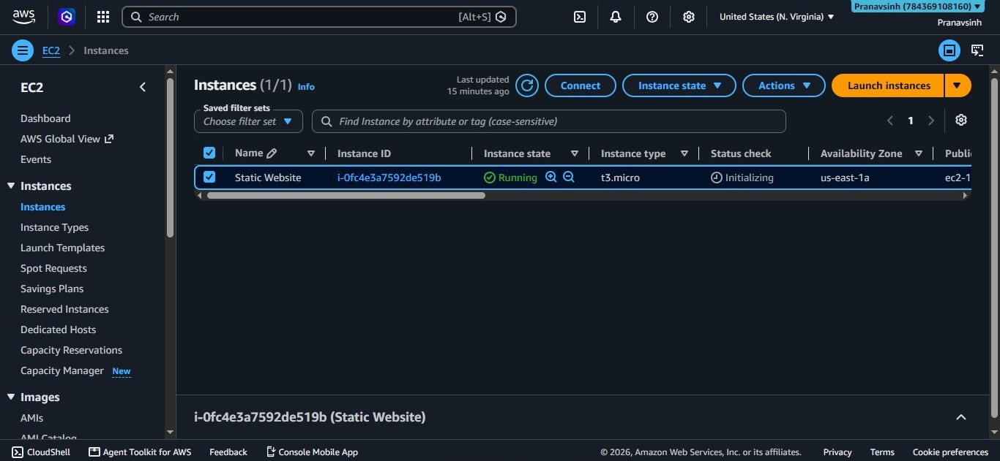
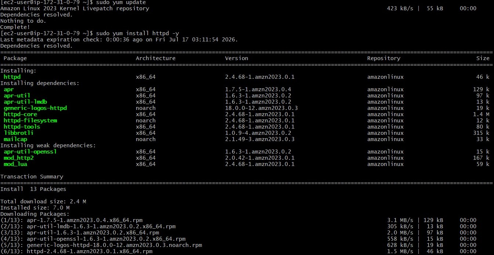
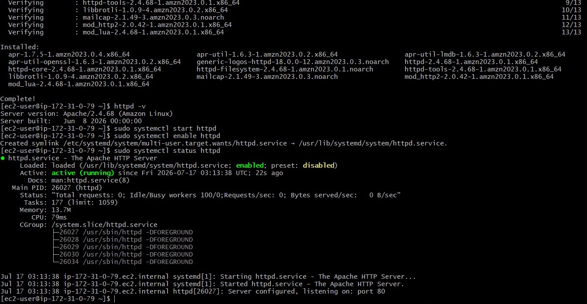
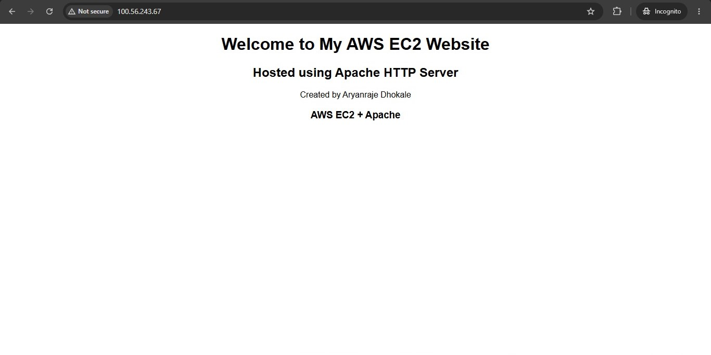

# Static Website Deployment on AWS EC2

## Using Apache HTTP Server (Amazon Linux 2023)

---

## Project Overview

This project demonstrates the deployment of a **Static Website** on an Amazon EC2 instance running Amazon Linux 2023, using the **Apache HTTP Server (httpd)**.

The site is a simple static HTML page, served directly from the EC2 instance and made publicly accessible over HTTP.

This project was completed as part of my **Cloud Learning Journey** to gain practical, hands-on experience in:

- Launching and configuring a virtual server on AWS
- Linux server administration
- Installing and managing the Apache web server
- Hosting a static website and verifying it over the public internet

---

## Technologies Used

| Technology | Purpose |
|---|---|
| AWS EC2 (Amazon Linux 2023) | Cloud Virtual Server |
| Apache HTTP Server (httpd) | Web Server |
| HTML | Static Website Content |
| systemctl | Service Management |

---

## Project Architecture

```
User Browser
     ↓
Public IP (Port 80)
     ↓
Apache HTTP Server (httpd)
     ↓
Static index.html
```

---

## Implementation Steps

---

### Step 1 — Launch EC2 Instance

Launched an Amazon Linux 2023 EC2 instance (`t3.micro`) named **Static Website**.
Configured the Security Group to allow inbound traffic on **Port 22 (SSH)** and **Port 80 (HTTP)**.

> 📸 *Screenshot: EC2 instance running in the AWS Console*
> 

---

### Step 2 — Update Packages and Install Apache

Connected to the instance via SSH and updated the system, then installed the Apache (`httpd`) package:

```bash
sudo yum update
sudo yum install httpd -y
```

> 📸 *Screenshot: httpd and its dependencies installing successfully*
> 

---

### Step 3 — Start, Enable and Verify the Apache Service

Started the Apache service and enabled it to auto-start on reboot:

```bash
sudo systemctl start httpd
sudo systemctl enable httpd
sudo systemctl status httpd
```

Verified that the service was `active (running)` and listening on port 80.

> 📸 *Screenshot: httpd version check and service status showing active (running)*
> 

---

### Step 4 — Verify Default Apache Page

Opened the EC2 instance's public IP in the browser to confirm Apache was serving the default **"It works!"** test page before adding custom content.

> 📸 *Screenshot: Default Apache test page loading in the browser*
> 

---

### Step 5 — Create Custom index.html

Navigated to the Apache web root directory and created a custom `index.html` page:

```bash
cd /var/www/html
sudo vim index.html
sudo cat index.html
```

> 📸 *Screenshot: Custom index.html content confirmed with cat*
> 

---

### Step 6 — Access the Deployed Website

Refreshed the browser at the EC2 public IP to confirm the custom static website loaded successfully, replacing the default Apache page.

> 📸 *Screenshot: Final static website output in the browser*
> 

---

## ✅ Project Output

- Apache HTTP Server installed and configured on AWS EC2
- httpd service running and enabled on boot
- Custom static website deployed to `/var/www/html`
- Website accessible via EC2 Public IP over HTTP
- Full deployment completed end-to-end

---

## 🎯 Learning Outcomes

Through this project I learned:

- How to launch and configure an EC2 instance on AWS
- How to configure Security Group rules for SSH and HTTP access
- How to install and manage the Apache HTTP Server on Amazon Linux 2023
- How to manage Linux services using `systemctl`
- How to deploy and serve static website content from `/var/www/html`
- How to verify a live deployment using the instance's public IP

---

## Author

**Aryanraje Dhokale**
Cloud and DevOps Learner
=======